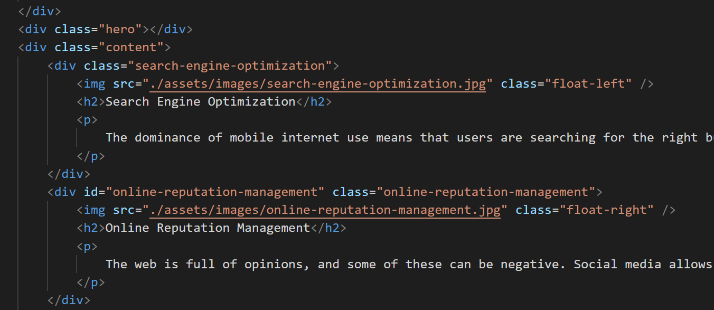
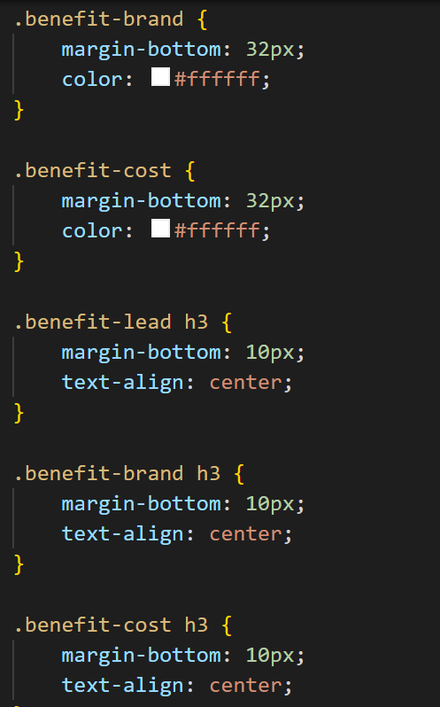

# Understanding Structure and Accessiblity

## Fixed index.html and style.css documents to add accessibility

In this project I learned the value of using the correct semantic language in HTML. Having to correct this coded from generic /div/ elements to a readable structure, helped me better understand the flow. It also showed me how effective the use of class and ID can be to simplify a style.css file

## Original Code

## Helpful Links
- [Understanding HTML Elements](https://developer.mozilla.org/en-US/docs/Web/HTML/Element)
- [How to write semantic HTML](https://hackernoon.com/how-to-write-semantic-html-dkq3ulo)
- [Markdown Cheat sheet](https://www.markdownguide.org/cheat-sheet/)
